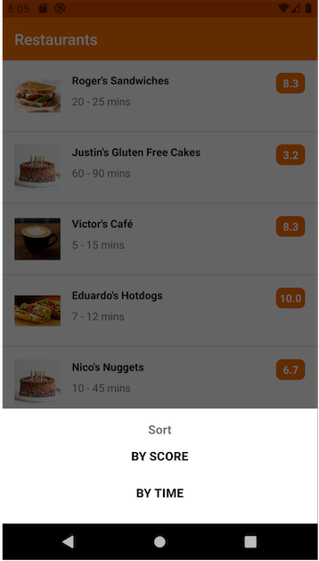

# SkipTheDishes Customer Kotlin Code Test

The goal of this test is to implement the sorting feature for our restaurant list.

## Requirements For Completion

Hint: Search for `TODO`

### 1. Sorting Algorithms

Implement the sort method at `RestaurantsViewModel.kt` in a way that all tests pass. The `SortType.kt` file contain specific documentation for their purposes.

For this task use the tests to validate the behavior.

### 2. Interactability

Implement the Sort button in the `RestaurantsFragment.kt` class. The button should allow the user to choose between sort methods, and apply the sort to the Restaurant list.

For this task run the Android application and interact with the app.

